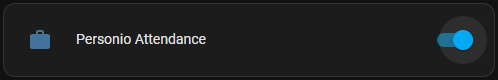

# Personio integration by [@Sese-Schneider](https://www.github.com/Sese-Schneider)

A Home Assistant integration with the Personio API.

[![GitHub Release][releases-shield]][releases]
![GitHub Downloads][downloads-shield]

[![License][license-shield]](LICENSE)
![Project Maintenance][maintenance-shield]
[![GitHub Activity][commits-shield]][commits]

**Features:**

- Automatically adding attendances through an added `switch`.

## Install

### HACS

*This repo can be installed as a custom repository in HACS.*

* Go to HACS → Integration
* Click on the three-dot-menu → Custom repositories
* Add `Sese-Schneider/ha-personio` as Integration.
* Use the FAB "Explore and download repositories" to search "Personio".
* Restart Home Assistant
* Install "Personio" as an integration in your settings.

## Setup

To use the integration, you need to have API access enabled on your Personio account. You might need to reach out to your People/HR department to request that.

1. Access your settings panel and click on "Generate new credential"
2. Specify an application identifier. You'll need that later.
3. You need to enable Read and Write Access to the "Attendances" data. Also read access to employee data is required to allow figuring out the Personio User ID based on email.
4. "Readable employee attributes" should be email.
5. You're now good to go. Install the integration in Home Assistant.
   - Enter the "Client ID" and "Client Secret" that were generated
   - "Partner identifier" can be left empty in most cases. It's only required in case you are a "partner company" of Personio.
   - "Application identifier" is the identifier you specified in step 2.

[commits-shield]: https://img.shields.io/github/commit-activity/y/Sese-Schneider/ha-personio.svg?style=for-the-badge
[commits]: https://github.com/Sese-Schneider/ha-personio/commits/master
[downloads-shield]: https://img.shields.io/github/downloads/Sese-Schneider/ha-personio/total.svg?style=for-the-badge
[license-shield]: https://img.shields.io/github/license/Sese-Schneider/ha-personio.svg?style=for-the-badge
[maintenance-shield]: https://img.shields.io/maintenance/yes/2023.svg?style=for-the-badge
[releases-shield]: https://img.shields.io/github/release/Sese-Schneider/ha-personio.svg?style=for-the-badge
[releases]: https://github.com/Sese-Schneider/ha-personio/releases
